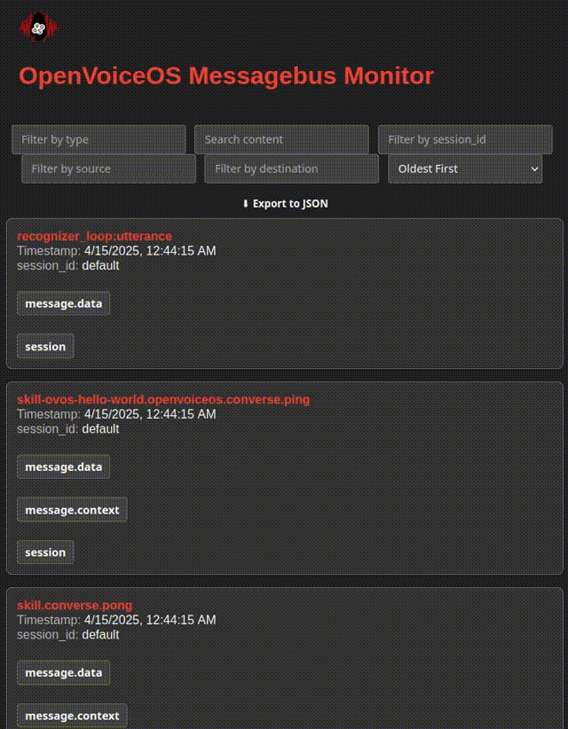

# OVOS Messagebus Monitor

A powerful web-based message bus monitor for [OpenVoiceOS (OVOS)](https://openvoiceos.com), built using FastAPI and
WebSockets. Designed as an essential tool for core developers, HiveMind integrators, and voice assistant tinkerers.



> ⚠️ **Private Repository:** This project is currently in early access for **HiveMindInsiders only**. Do not share
> externally.

---

## ✨ Features

- 🟢 **Live Monitoring**: Inspect real-time traffic on the OVOS Messagebus via WebSocket.
- 🔐 **Basic Auth**: Protect your monitor with simple, customizable credentials.
- 🔍 **Deep Filtering**:
    - **By Message Type** – e.g., `recognizer_loop:utterance`, `speak`
    - **By Source/Destination** – isolate traffic by skill or service, perfect for **HiveMind** tracing.
    - **By Session ID** – track conversation flow across subsystems.
    - **Full Text Search** – search across all payloads and context.
- 📤 **Export to JSON**: Download the entire message log with one click for offline debugging.
- 🧠 **HiveMind Ready**: Tailored to help inspect inter-node communication in HiveMind topologies.
- ⚡ **Single File App**: Just `busmon.py`—easy to modify, extend, or embed.

---

## ⚠️ Warning

This tool is **not suited for production use**. It is intended for **local personal administration only**.

> - This tool is **intended to run on the same device** as OpenVoiceOS.
> - **Do not expose it to the public internet.**
> - It includes **no encryption or access controls**.
> - It is recommended to **run it manually when needed**, and **not leave it running 24/7**.

---

## 🚀 Quick Start

### 1. Clone and Run

```bash
git clone https://github.com/HiveMindInsiders/ovos-busmon
cd ovos-busmon
```

### 2. Run the App

#### 🐳 With Docker

```bash
docker-compose up --build
```

#### ▶️ Directly

```bash
pip install -r requirements.txt
python busmon.py
```

### 3. Access the UI

Navigate to [http://0.0.0.0:8005](http://0.0.0.0:8005)

**Default login:**

- Username: `ovos`
- Password: `ovos`

You can customize these in `.env`.

---

## 🔧 Configuration

Create a `.env` file to set your credentials:

```env
USERNAME=myuser
PASSWORD=mypass
```

---

## 📦 JSON Export

Need to debug offline or share logs with the team?

Just click **⬇ Export to JSON** in the UI to download the full session as `bus_messages.json`.

---

## 👀 Ideal Use Cases

- Debugging **HiveMind** node routing and message flow
- Tracking down **source/destination** issues in skills
- Monitoring **session-level context** propagation
- Teaching or demoing **OVOS internals** live

---

## 📄 License

MIT License © 2025 TigreGóticoLda.