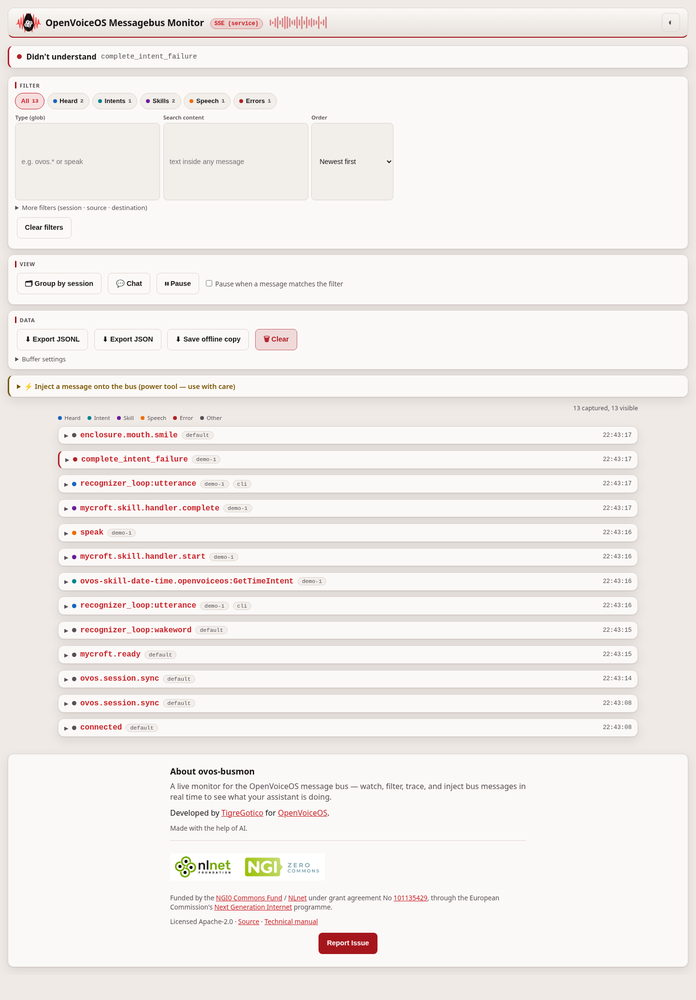
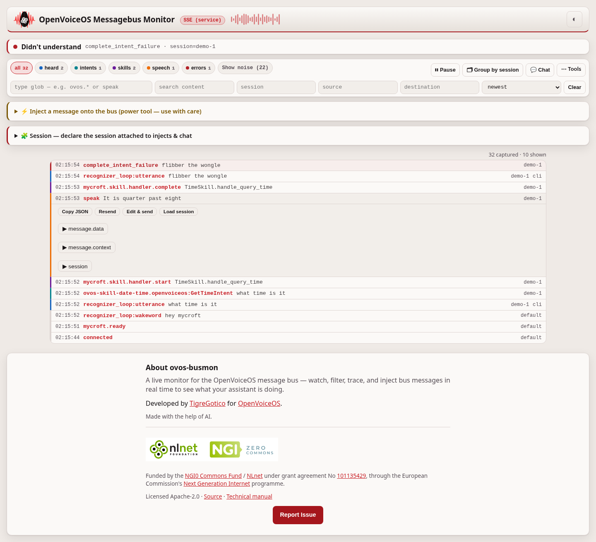
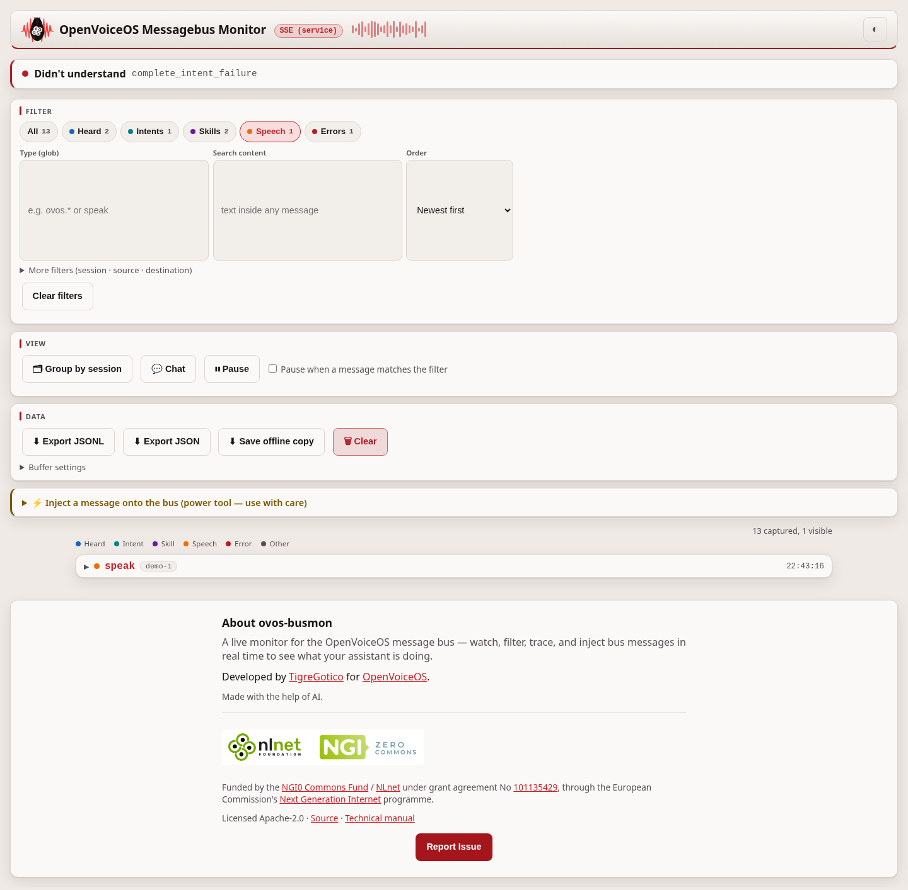
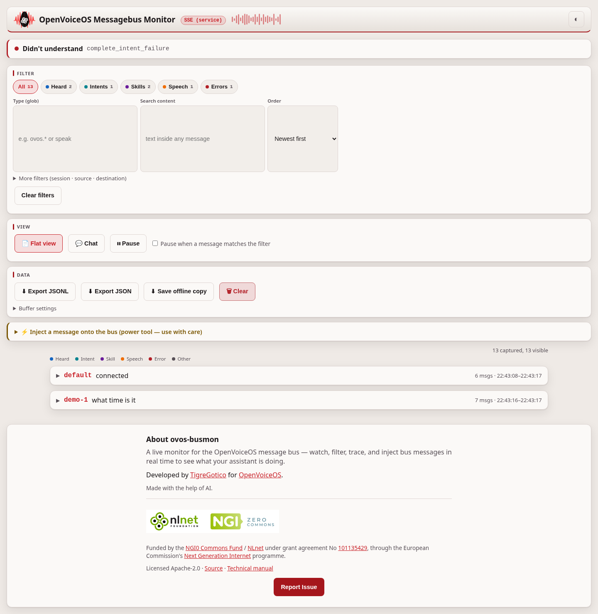
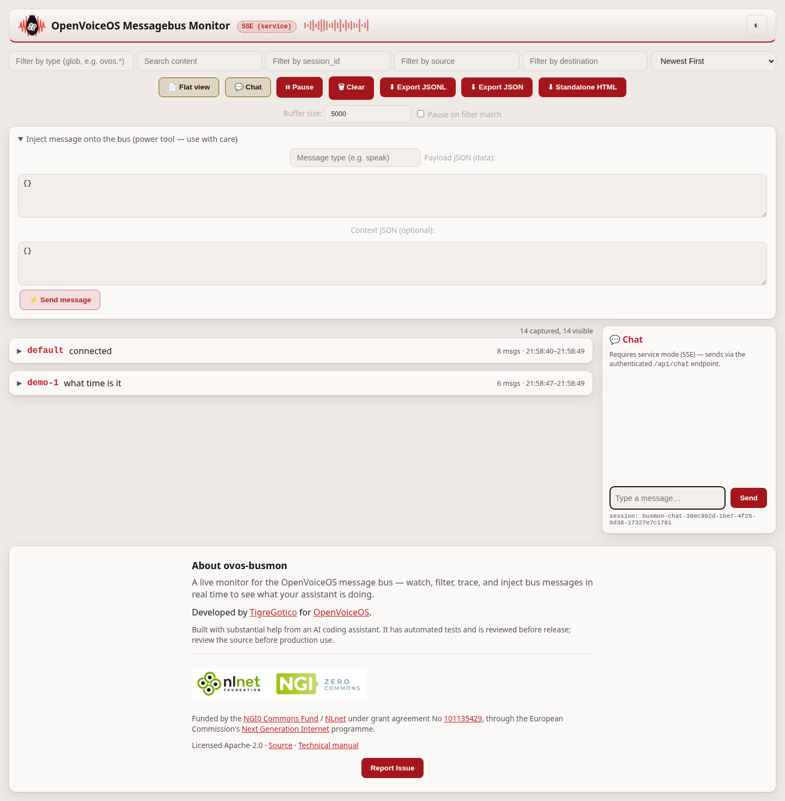
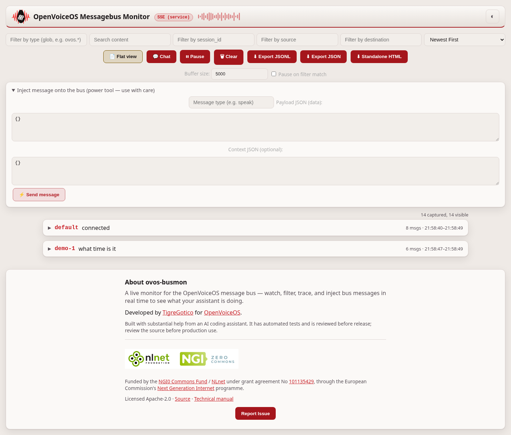

# Using ovos-busmon

`ovos-busmon` streams every message on the OVOS messagebus to a browser, where
you can filter, inspect, trace, inject and converse. This guide walks through
each part of the UI. For installation and transport modes, see the
[README](../README.md).

## The live stream

The default view is a flat, live-updating list of every bus message. Each entry
shows the message type, timestamp, and the session/source/destination routing
fields; click an entry to expand its `data`, `context` and `session` payloads
as syntax-highlighted JSON.

### Filtering

The top bar filters the visible stream without discarding anything from the
capture buffer:

- **Type filter** — glob patterns, e.g. `ovos.*`, `recognizer_loop:*`, `speak`
- **Search** — full-text across type, data, context and session
- **Session / source / destination** — match the routing fields exactly
- **Sort** — newest-first (default) or oldest-first

### Buffer and pause

The client keeps a bounded buffer (default 5000 messages, configurable in the
toolbar). The oldest messages are dropped first, and the status bar shows how
many were dropped. **Pause** freezes ingestion. **Pause on filter match**
auto-pauses the instant an incoming message matches the active filters. Use
it to catch one specific message live without losing it to scrollback.

## Timeline view

**Timeline view** groups the flat stream by session id (falling back to an
utterance-correlation id in `context` when present), so one interaction —
utterance → pipeline/intent matching → skill handler → speak — reads as a
single expandable trace. Each step is tagged with a category badge:
`utterance`, `pipeline`, `skill`, `output` or `other`.

## Chat panel

The **Chat** button opens a side panel for conversing with the assistant in
text, straight from the monitor. Each browser session gets one stable session
id, shown at the bottom of the panel and kept across reloads, so multi-turn
context and converse keep working across the whole conversation.

Replies (`ovos.utterance.speak` or `speak`) that belong to that session render
as bubbles. Everything else keeps flowing through the normal stream, where you
can watch the full pipeline handle your utterance.

Chat requires service mode — it posts to the authenticated `/api/chat`
endpoint, which emits `recognizer_loop:utterance` shaped exactly like a real
text client.

## Injecting messages

The **Inject** panel sends an arbitrary message onto the bus: type, `data`
JSON, and optional `context` JSON. The message is validated server-side,
emitted through the bus client, and appears back in the stream through the
monitor's own listener. This gives you a full bus REPL for reproducing bugs.

## HTTP API

All endpoints require HTTP Basic auth (see README for configuration).

| Endpoint | Description |
|---|---|
| `GET /api/status` | Service health, buffer stats, bus coordinates |
| `GET /api/messages?since_id=N&limit=M` | Ring buffer contents |
| `GET /api/stream` | SSE live tail |

| Endpoint | Description |
|---|---|
| `POST /api/send` | Inject `{type, data, context}` onto the bus |
| `POST /api/chat` | Send `{utterance, lang, session_id}` as a text utterance |
| `GET /api/export` | JSONL download of the full capture buffer |

---
[Home](../README.md)
