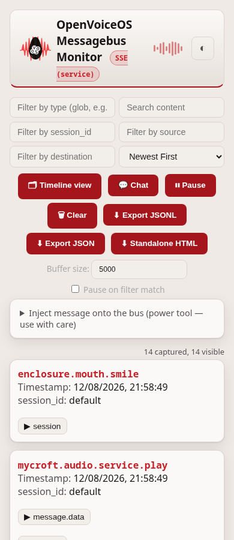
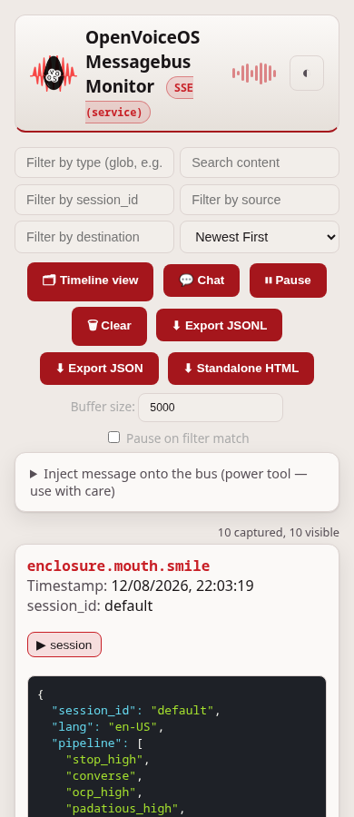
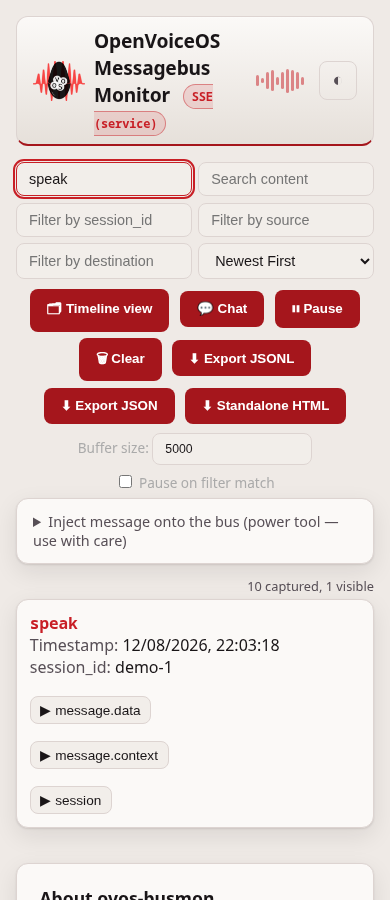
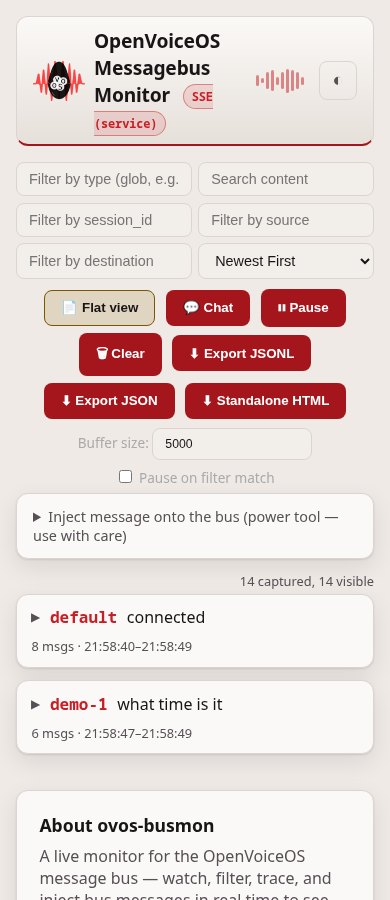
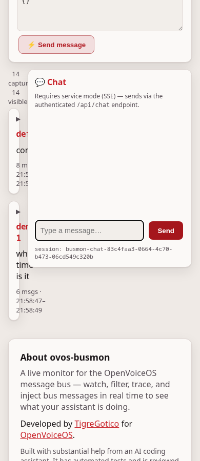
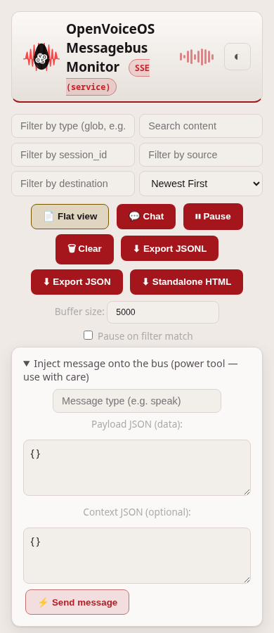

# Using ovos-busmon

`ovos-busmon` streams every message on the OVOS messagebus to a browser. There
you can filter, inspect, trace, inject, and chat. This page is a reference for
each part of the UI. For installation and the transport modes, see the
[README](../README.md). For a step-by-step walkthrough, see the
[tutorials](tutorials.md).

## The live stream

The default view is a flat, live list of every bus message. Each row shows the
message type, the time, and the session, source, and destination routing
fields. Click a row to expand its `data`, `context` and `session` payloads as
highlighted JSON.

### Filtering

The top bar filters the visible stream. It does not discard anything from the
capture buffer.

- **Type filter**: glob patterns, for example `ovos.*`, `recognizer_loop:*`, or
  `speak`.
- **Search**: full-text across type, data, context and session.
- **Session, source, and destination**: match each routing field exactly.
- **Sort**: newest first (the default) or oldest first.

### Buffer and pause

The client keeps a bounded buffer. The default is 5000 messages, and you set the
size in the toolbar. The client drops the oldest messages first, and the status
bar shows how many it dropped.

**Pause** stops ingestion. **Pause on filter match** stops the stream the
instant an incoming message matches the active filters. Use it to catch one
specific message live without losing it to scrollback.

## Timeline view

**Timeline view** groups the flat stream by session id. When a session id is
absent, it falls back to an utterance-correlation id in `context`. One
interaction then reads as a single expandable trace: utterance, then pipeline
match, then skill handler, then speak output. Each step carries a category
badge: `utterance`, `pipeline`, `skill`, `output`, or `other`.

## Chat panel

The **Chat** button opens a side panel. There you chat with the assistant in
text, straight from the monitor. Each browser session gets one stable session
id. The panel shows the id at the bottom and keeps it across reloads, so
multi-turn context and converse keep working.

Replies that belong to that session (`ovos.utterance.speak` or `speak`) render
as bubbles. Everything else keeps flowing through the normal stream, where you
watch the full pipeline handle your utterance.

Chat needs service mode. It posts to the `/api/chat` endpoint, which emits
`recognizer_loop:utterance` shaped exactly like a real text client.

## Injecting messages

The **Inject** panel sends an arbitrary message onto the bus: a type, a `data`
JSON, and an optional `context` JSON. The service validates the message, emits
it through the bus client, and the message comes back in the stream through the
monitor's own listener. This gives you a full bus REPL for reproducing bugs.

## HTTP API

The API endpoints need authentication only when you configure it. Set
`BUSMON_TOKEN`, or set `BUSMON_USERNAME` and `BUSMON_PASSWORD`. With no
credentials set, the endpoints are open, and the service allows this on a
loopback bind only. See the [README](../README.md) for the rules.

| Endpoint | Description |
|---|---|
| `GET /api/status` | Service health, buffer stats, bus coordinates |
| `GET /api/messages?since_id=N&limit=M` | Ring buffer contents |
| `GET /api/stream` | SSE live tail |
| `POST /api/send` | Inject `{type, data, context}` onto the bus |
| `POST /api/chat` | Send `{utterance, lang, session_id}` as a text utterance |
| `GET /api/export` | JSONL download of the full capture buffer |

A token travels as `?token=` on the URL or as an `Authorization: Bearer` header.
The `?token=` form lets the SSE stream carry the token, which HTTP Basic cannot.

---
[← Tutorials](tutorials.md) · [Home](index.md) · [Troubleshooting →](troubleshooting.md)
